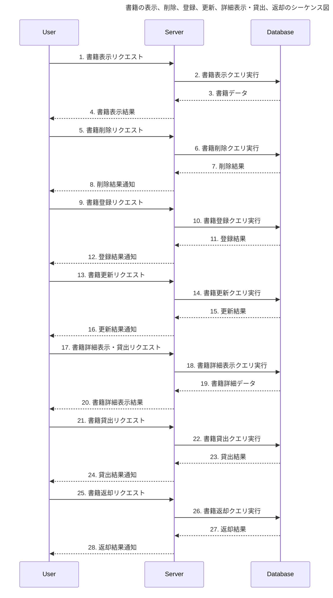

```mermaid
sequenceDiagram
    title: 書籍の表示、削除、登録、更新、詳細表示・貸出、返却のシーケンス図

    participant User
    participant Server
    participant BookDB as Database

    User->>Server: 1. 書籍表示リクエスト
    Server->>BookDB: 2. 書籍表示クエリ実行
    BookDB-->>Server: 3. 書籍データ
    Server-->>User: 4. 書籍表示結果

    User->>Server: 5. 書籍削除リクエスト
    Server->>BookDB: 6. 書籍削除クエリ実行
    BookDB-->>Server: 7. 削除結果
    Server-->>User: 8. 削除結果通知

    User->>Server: 9. 書籍登録リクエスト
    Server->>BookDB: 10. 書籍登録クエリ実行
    BookDB-->>Server: 11. 登録結果
    Server-->>User: 12. 登録結果通知

    User->>Server: 13. 書籍更新リクエスト
    Server->>BookDB: 14. 書籍更新クエリ実行
    BookDB-->>Server: 15. 更新結果
    Server-->>User: 16. 更新結果通知

    User->>Server: 17. 書籍詳細表示・貸出リクエスト
    Server->>BookDB: 18. 書籍詳細表示クエリ実行
    BookDB-->>Server: 19. 書籍詳細データ
    Server-->>User: 20. 書籍詳細表示結果
    User->>Server: 21. 書籍貸出リクエスト
    Server->>BookDB: 22. 書籍貸出クエリ実行
    BookDB-->>Server: 23. 貸出結果
    Server-->>User: 24. 貸出結果通知

    User->>Server: 25. 書籍返却リクエスト
    Server->>BookDB: 26. 書籍返却クエリ実行
    BookDB-->>Server: 27. 返却結果
    Server-->>User: 28. 返却結果通知
```
