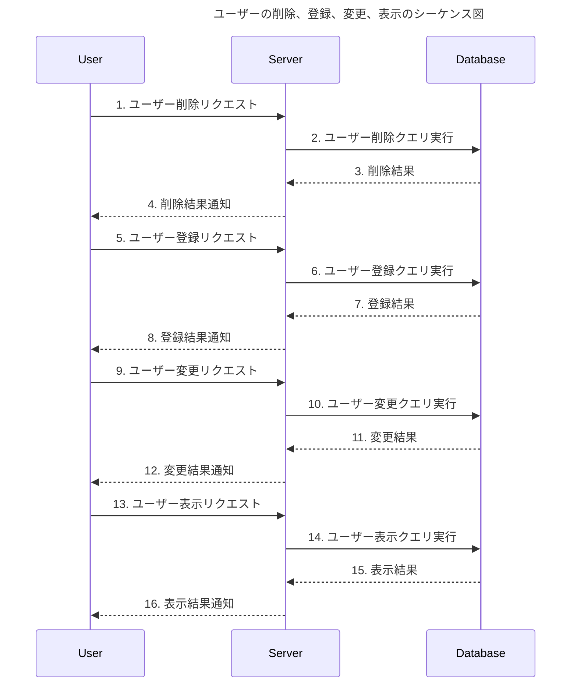

```mermaid

sequenceDiagram
    title: ユーザーの削除、登録、変更、表示のシーケンス図

    participant User
    participant Server
    participant ELUSER as Database

    User->>Server: 1. ユーザー削除リクエスト
    Server->>ELUSER: 2. ユーザー削除クエリ実行
    ELUSER-->>Server: 3. 削除結果
    Server-->>User: 4. 削除結果通知

    User->>Server: 5. ユーザー登録リクエスト
    Server->>ELUSER: 6. ユーザー登録クエリ実行
    ELUSER-->>Server: 7. 登録結果
    Server-->>User: 8. 登録結果通知

    User->>Server: 9. ユーザー変更リクエスト
    Server->>ELUSER: 10. ユーザー変更クエリ実行
    ELUSER-->>Server: 11. 変更結果
    Server-->>User: 12. 変更結果通知

    User->>Server: 13. ユーザー表示リクエスト
    Server->>ELUSER: 14. ユーザー表示クエリ実行
    ELUSER-->>Server: 15. 表示結果
    Server-->>User: 16. 表示結果通知


```
